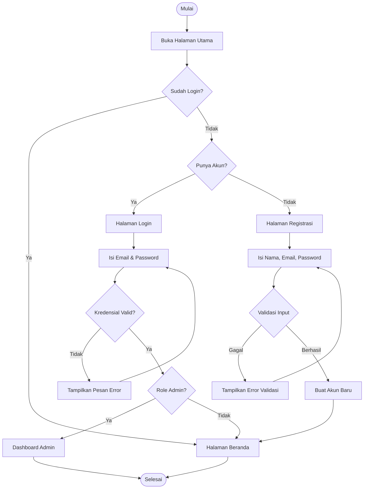
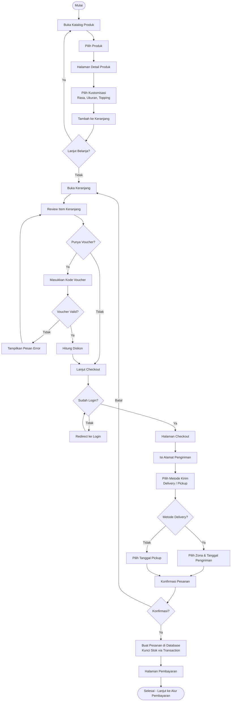
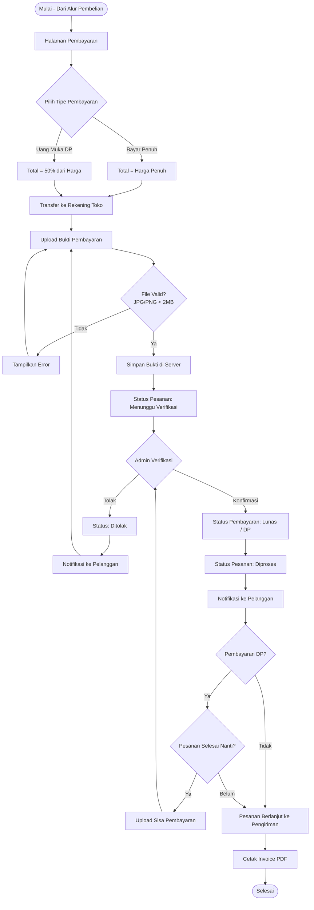
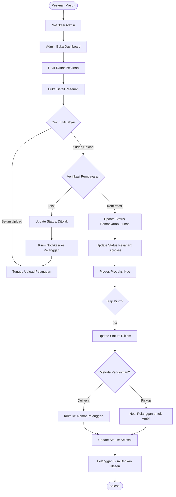
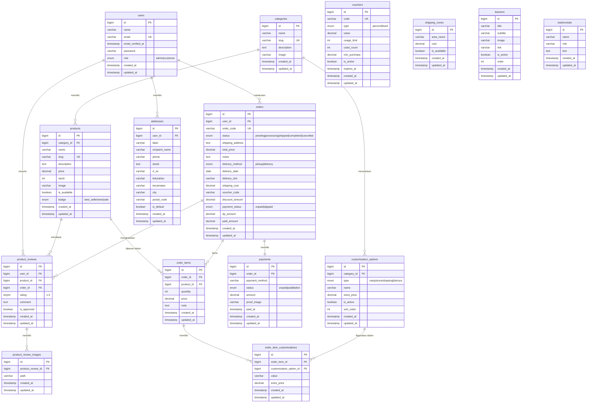

# LAPORAN UAS PEMROGRAMAN WEB

<div align="center">

---

## JAGOAN KUE
### Aplikasi E-Commerce Pemesanan Kue Berbasis Web

---

**Disusun Oleh:**

**Muhammad Zidane**
**NIM: 25343071**

---

**Mata Kuliah:** Pemrograman Web

**Program Studi:** Informatika

**Fakultas:** Fakultas Teknik

**Universitas:** Universitas Negeri Padang

**Tahun:** 2025

---

</div>

---

## DAFTAR ISI

1. [Identitas Anggota](#1-identitas-anggota)
2. [Latar Belakang Proyek](#2-latar-belakang-proyek)
3. [Analisis Kebutuhan Sistem](#3-analisis-kebutuhan-sistem)
4. [Perancangan Sistem](#4-perancangan-sistem)
5. [Implementasi Program](#5-implementasi-program)
6. [Penjelasan Fitur-Fitur Utama](#6-penjelasan-fitur-fitur-utama)
7. [Tampilan Antarmuka](#7-tampilan-antarmuka)
8. [Kesimpulan](#8-kesimpulan)

---

## 1. Identitas Anggota

| Keterangan | Detail |
|---|---|
| **Nama** | Muhammad Zidane |
| **NIM** | 25343071 |
| **Program Studi** | Informatika |
| **Fakultas** | Fakultas Teknik |
| **Universitas** | Universitas Negeri Padang |
| **Mata Kuliah** | Pemrograman Web |

---

## 2. Latar Belakang Proyek

### 2.1 Gambaran Umum

**Jagoan Kue** adalah sebuah aplikasi e-commerce berbasis web yang dirancang khusus untuk memfasilitasi proses pemesanan kue secara daring. Aplikasi ini dibangun menggunakan framework Laravel 12 dengan konsep arsitektur Model-View-Controller (MVC) yang memisahkan logika bisnis, tampilan, dan data secara terstruktur.

### 2.2 Latar Belakang dan Motivasi

Industri kuliner, khususnya usaha kue dan pastri, mengalami pertumbuhan pesat di Indonesia seiring dengan meningkatnya gaya hidup masyarakat urban yang dinamis. Namun demikian, banyak pelaku usaha kue skala menengah masih mengandalkan cara konvensional dalam mengelola pemesanan, yakni melalui pesan langsung (WhatsApp, telepon) atau kunjungan langsung ke toko. Metode ini memiliki sejumlah keterbatasan yang signifikan:

1. **Keterbatasan Jangkauan Pasar:** Pelanggan yang berada di luar area jangkauan toko sulit mendapatkan akses informasi produk secara real-time.
2. **Inefisiensi Operasional:** Pencatatan pesanan secara manual rawan terjadi kesalahan, sulit dilacak, dan membutuhkan waktu ekstra untuk pengelolaan.
3. **Ketidakjelasan Status Pesanan:** Pelanggan tidak memiliki sarana untuk memantau status pesanan mereka secara mandiri.
4. **Minimnya Personalisasi:** Sulit bagi pelanggan untuk mengustomisasi produk (pilihan rasa, ukuran, topping) secara mandiri tanpa komunikasi bolak-balik dengan penjual.
5. **Kendala Pembayaran:** Proses verifikasi pembayaran manual memakan waktu dan tidak transparan bagi kedua belah pihak.

### 2.3 Permasalahan yang Diselesaikan

Berdasarkan latar belakang di atas, aplikasi Jagoan Kue hadir sebagai solusi digital yang menyelesaikan permasalahan-permasalahan berikut:

- **Digitalisasi Katalog Produk:** Menampilkan seluruh produk beserta foto, harga, stok, dan deskripsi secara online agar dapat diakses kapan saja dan di mana saja.
- **Sistem Pemesanan Terstruktur:** Menyediakan alur pemesanan yang jelas mulai dari pemilihan produk, kustomisasi, pengisian alamat pengiriman, pemilihan metode pengiriman, hingga konfirmasi pembayaran.
- **Transparansi Pembayaran:** Mengimplementasikan sistem upload bukti pembayaran dan verifikasi oleh admin, serta mendukung sistem uang muka (DP) untuk pemesanan kue khusus.
- **Manajemen Pengiriman:** Menyediakan pilihan zona pengiriman dengan biaya yang transparan serta opsi pengambilan langsung (pickup).
- **Pelacakan Pesanan Real-Time:** Pelanggan dapat memantau status pesanan mereka secara mandiri melalui halaman status pesanan.
- **Sistem Ulasan:** Membangun kepercayaan pelanggan baru melalui sistem ulasan dan penilaian produk yang telah diverifikasi.
- **Dashboard Administrasi Komprehensif:** Menyediakan panel admin dengan fitur analitik penjualan, manajemen pelanggan, laporan keuangan, dan ekspor data untuk membantu pengambilan keputusan bisnis.

---

## 3. Analisis Kebutuhan Sistem

### 3.1 Kebutuhan Fungsional

Berdasarkan analisis kode sumber, berikut adalah kebutuhan fungsional yang telah diimplementasikan dalam aplikasi:

#### 3.1.1 Modul Autentikasi dan Manajemen Pengguna

| No | Kebutuhan Fungsional | Status |
|---|---|---|
| F-01 | Sistem registrasi akun pelanggan baru | ✅ Terimplementasi |
| F-02 | Sistem login dengan email dan password | ✅ Terimplementasi |
| F-03 | Pemulihan password melalui email | ✅ Terimplementasi |
| F-04 | Pengelolaan profil pengguna (nama, email, foto) | ✅ Terimplementasi |
| F-05 | Perubahan password dengan validasi kekuatan | ✅ Terimplementasi |
| F-06 | Penghapusan akun secara permanen | ✅ Terimplementasi |
| F-07 | Manajemen alamat pengiriman tersimpan | ✅ Terimplementasi |
| F-08 | Penetapan alamat default | ✅ Terimplementasi |

#### 3.1.2 Modul Katalog Produk

| No | Kebutuhan Fungsional | Status |
|---|---|---|
| F-09 | Menampilkan daftar produk dengan pencarian | ✅ Terimplementasi |
| F-10 | Filter produk berdasarkan kategori dan harga | ✅ Terimplementasi |
| F-11 | Pengurutan produk (harga, nama, terbaru) | ✅ Terimplementasi |
| F-12 | Detail produk dengan gambar dan deskripsi | ✅ Terimplementasi |
| F-13 | Opsi kustomisasi produk (rasa, ukuran, topping) | ✅ Terimplementasi |
| F-14 | Tampilan badge produk (Best Seller, New, Sale) | ✅ Terimplementasi |
| F-15 | Indikator ketersediaan stok produk | ✅ Terimplementasi |

#### 3.1.3 Modul Keranjang Belanja

| No | Kebutuhan Fungsional | Status |
|---|---|---|
| F-16 | Penambahan produk ke keranjang dengan kustomisasi | ✅ Terimplementasi |
| F-17 | Pembaruan jumlah item di keranjang | ✅ Terimplementasi |
| F-18 | Penghapusan item dari keranjang | ✅ Terimplementasi |
| F-19 | Pengosongan seluruh keranjang | ✅ Terimplementasi |
| F-20 | Penerapan kode voucher diskon | ✅ Terimplementasi |

#### 3.1.4 Modul Pemesanan

| No | Kebutuhan Fungsional | Status |
|---|---|---|
| F-21 | Proses checkout dari keranjang | ✅ Terimplementasi |
| F-22 | Proses checkout langsung satu produk | ✅ Terimplementasi |
| F-23 | Pemilihan metode pengiriman (delivery/pickup) | ✅ Terimplementasi |
| F-24 | Pemilihan slot tanggal pengiriman | ✅ Terimplementasi |
| F-25 | Kalkulasi biaya pengiriman berdasarkan zona | ✅ Terimplementasi |
| F-26 | Penerapan voucher diskon saat checkout | ✅ Terimplementasi |
| F-27 | Penguncian stok saat transaksi (locking) | ✅ Terimplementasi |
| F-28 | Tampilan daftar riwayat pesanan pelanggan | ✅ Terimplementasi |
| F-29 | Detail pesanan dengan semua informasi | ✅ Terimplementasi |
| F-30 | Pelacakan status pesanan secara real-time | ✅ Terimplementasi |

#### 3.1.5 Modul Pembayaran

| No | Kebutuhan Fungsional | Status |
|---|---|---|
| F-31 | Sistem pembayaran penuh (full payment) | ✅ Terimplementasi |
| F-32 | Sistem uang muka / down payment (DP) | ✅ Terimplementasi |
| F-33 | Upload bukti pembayaran oleh pelanggan | ✅ Terimplementasi |
| F-34 | Verifikasi pembayaran oleh admin | ✅ Terimplementasi |
| F-35 | Penolakan pembayaran dengan alasan | ✅ Terimplementasi |
| F-36 | Cetak invoice PDF | ✅ Terimplementasi |

#### 3.1.6 Modul Ulasan Produk

| No | Kebutuhan Fungsional | Status |
|---|---|---|
| F-37 | Penulisan ulasan produk setelah pesanan selesai | ✅ Terimplementasi |
| F-38 | Upload foto untuk ulasan (multiple images) | ✅ Terimplementasi |
| F-39 | Pemberian rating bintang (1-5) | ✅ Terimplementasi |
| F-40 | Pengeditan dan penghapusan ulasan | ✅ Terimplementasi |
| F-41 | Moderasi ulasan oleh admin | ✅ Terimplementasi |

#### 3.1.7 Modul Administrasi

| No | Kebutuhan Fungsional | Status |
|---|---|---|
| F-42 | Dashboard dengan KPI penjualan | ✅ Terimplementasi |
| F-43 | Manajemen produk (CRUD + gambar) | ✅ Terimplementasi |
| F-44 | Manajemen kategori (CRUD + gambar) | ✅ Terimplementasi |
| F-45 | Manajemen opsi kustomisasi kue | ✅ Terimplementasi |
| F-46 | Manajemen pesanan (update status) | ✅ Terimplementasi |
| F-47 | Manajemen banner homepage | ✅ Terimplementasi |
| F-48 | Manajemen voucher diskon | ✅ Terimplementasi |
| F-49 | Manajemen zona pengiriman dan biaya | ✅ Terimplementasi |
| F-50 | Manajemen pelanggan | ✅ Terimplementasi |
| F-51 | Laporan analitik penjualan dengan grafik | ✅ Terimplementasi |
| F-52 | Laporan keuangan (pendapatan, DP, lunas) | ✅ Terimplementasi |
| F-53 | Ekspor laporan ke format Excel | ✅ Terimplementasi |
| F-54 | Kalender produksi / lead time | ✅ Terimplementasi |
| F-55 | Sistem notifikasi pesanan baru | ✅ Terimplementasi |

### 3.2 Kebutuhan Non-Fungsional

#### 3.2.1 Keamanan (Security)

- **Autentikasi:** Sistem login yang aman menggunakan Laravel Breeze dengan hashing password (bcrypt).
- **Otorisasi Berbasis Role:** Middleware `EnsureUserIsAdmin` memastikan hanya pengguna dengan role `admin` yang dapat mengakses panel administrasi.
- **Security Headers:** Middleware `SecurityHeaders` menambahkan header HTTP keamanan (X-Frame-Options, X-Content-Type-Options, X-XSS-Protection, Referrer-Policy).
- **CSRF Protection:** Semua form dilindungi token CSRF bawaan Laravel.
- **Rate Limiting:** Endpoint sensitif seperti tambah keranjang, buat pesanan, dan upload bukti dibatasi 20 request per menit.
- **Validasi Input:** Semua input pengguna divalidasi di sisi server menggunakan Form Request Laravel.
- **Password Policy:** Kata sandi minimal 8 karakter, mengandung huruf besar, kecil, angka, dan simbol.
- **Paksa HTTPS:** AppServiceProvider memaksa protokol HTTPS di lingkungan produksi.

#### 3.2.2 Performa (Performance)

- **Database Transactions:** Operasi kritis seperti pembuatan pesanan menggunakan transaksi database untuk menjaga integritas data.
- **Pessimistic Locking:** Query `lockForUpdate()` digunakan saat mengurangi stok untuk mencegah kondisi balapan (race condition).
- **Eager Loading:** Relasi Eloquent di-load secara eager untuk menghindari masalah N+1 query.
- **Pagination:** Daftar produk, pesanan, dan pelanggan menggunakan pagination untuk efisiensi loading.

#### 3.2.3 Kegunaan (Usability)

- **Responsif:** Antarmuka dirancang responsif menggunakan Tailwind CSS untuk berbagai ukuran layar.
- **Bahasa Indonesia:** Antarmuka menggunakan bahasa Indonesia (`lang="id"`) agar mudah dipahami pengguna lokal.
- **Feedback Real-Time:** Notifikasi sukses/gagal ditampilkan melalui flash session untuk setiap aksi pengguna.
- **Error Pages:** Halaman error khusus untuk kode 403, 404, dan 500.

#### 3.2.4 Skalabilitas dan Pemeliharaan

- **Arsitektur MVC:** Pemisahan jelas antara logika bisnis, tampilan, dan model data.
- **Queue System:** Sistem antrian (jobs) tersedia untuk proses asinkron seperti pengiriman email.
- **Cache System:** Tabel cache tersedia untuk optimasi performa.
- **Testing:** Framework Pest tersedia untuk pengujian unit dan fitur.

---

## 4. Perancangan Sistem

### 4.1 Flowchart Alur Utama Aplikasi

#### 4.1.1 Alur Registrasi dan Login



#### 4.1.2 Alur Pembelian Produk



#### 4.1.3 Alur Pembayaran



#### 4.1.4 Alur Manajemen Pesanan (Admin)



---

### 4.2 Entity Relationship Diagram (ERD)



---

### 4.3 Arsitektur MVC (Model-View-Controller)

Aplikasi Jagoan Kue menggunakan pola arsitektur **Model-View-Controller (MVC)** yang merupakan standar framework Laravel. Berikut adalah penjelasan masing-masing lapisan:

#### 4.3.1 Model (M)

Model bertanggung jawab atas semua interaksi dengan basis data dan representasi data bisnis. Setiap tabel database memiliki model Eloquent yang bersesuaian.

```
app/Models/
├── User.php               - Model pengguna dengan role-based access
├── Category.php           - Model kategori produk
├── Product.php            - Model produk dengan route key slug
├── Order.php              - Model pesanan dengan status tracking
├── OrderItem.php          - Model item pesanan
├── OrderItemCustomization.php - Model kustomisasi item
├── Payment.php            - Model pembayaran dengan label helper
├── Address.php            - Model alamat dengan full_address accessor
├── CustomizationOption.php - Model opsi kustomisasi kue
├── ProductReview.php      - Model ulasan produk
├── ProductReviewImage.php - Model gambar ulasan
├── ShippingZone.php       - Model zona pengiriman
├── Voucher.php            - Model voucher dengan logika validasi
├── Banner.php             - Model banner beranda
└── Testimonial.php        - Model testimoni statis
```

**Fitur kunci Model:**
- Relasi Eloquent (`hasMany`, `belongsTo`, `hasOne`) untuk query efisien
- Accessor/Mutator untuk pemformatan data
- Scopes untuk query yang dapat digunakan ulang
- Model `Voucher` memiliki method `isValid($amount)` dan `calculateDiscount($amount)`

#### 4.3.2 View (V)

View bertanggung jawab atas presentasi data kepada pengguna menggunakan Blade Templating Engine Laravel.

```
resources/views/
├── layouts/           - Template utama (app, guest, navigation)
├── partials/          - Komponen parsial (navbar, footer)
├── admin/             - Tampilan panel administrasi (16 halaman)
├── auth/              - Tampilan autentikasi (6 halaman)
├── account/           - Halaman akun pengguna (3 halaman)
├── profile/           - Halaman profil (3 halaman + 3 partials)
├── orders/            - Halaman pesanan (7 halaman)
├── products/          - Halaman produk (4 halaman)
├── cart/              - Halaman keranjang (1 halaman)
├── home/              - Halaman beranda (1 halaman)
├── pages/             - Halaman statis (about)
├── pdf/               - Template invoice PDF
├── emails/            - Template email notifikasi
├── errors/            - Halaman error (403, 404, 500)
└── components/        - Komponen Blade reusable (14 komponen)
```

**Layout Utama:**
- `layouts/app.blade.php` — Layout frontend pelanggan dengan font Playfair Display + Plus Jakarta Sans
- `layouts/guest.blade.php` — Layout halaman autentikasi
- `admin/layout.blade.php` — Layout panel admin dengan sidebar responsif

#### 4.3.3 Controller (C)

Controller berfungsi sebagai penghubung antara Model dan View, menangani logika bisnis dan alur request HTTP.

```
app/Http/Controllers/
├── HomeController.php          - Halaman beranda
├── ProductController.php       - Katalog & CRUD produk
├── CartController.php          - Manajemen keranjang belanja
├── OrderController.php         - Proses pemesanan & pembayaran
├── AccountController.php       - Manajemen akun pengguna
├── AddressController.php       - Manajemen alamat pengiriman
├── ProfileController.php       - Profil pengguna
├── ProductReviewController.php - Sistem ulasan produk
├── VoucherController.php       - Validasi voucher (JSON API)
├── AdminController.php         - Panel administrasi lengkap
└── Admin/
    └── CustomizationController.php - Manajemen kustomisasi kue
```

#### 4.3.4 Middleware dan Lapisan Keamanan

```
app/Http/Middleware/
├── EnsureUserIsAdmin.php  - Proteksi route admin (role-based)
└── SecurityHeaders.php    - Penambahan HTTP security headers
```

#### 4.3.5 Lapisan Tambahan (Beyond MVC)

```
app/
├── Rules/
│   └── StrongPassword.php         - Aturan validasi password kuat
├── Exports/
│   └── LaporanPenjualanExport.php  - Ekspor Excel laporan penjualan
├── Mail/
│   ├── OrderConfirmationMail.php   - Email konfirmasi pesanan
│   └── OrderStatusUpdatedMail.php  - Email update status pesanan
├── Notifications/
│   └── NewOrderNotification.php   - Notifikasi database pesanan baru
└── Providers/
    └── AppServiceProvider.php     - Boot konfigurasi aplikasi
```

---

## 5. Implementasi Program

### 5.1 Stack Teknologi

| Kategori | Teknologi | Versi |
|---|---|---|
| **Backend Framework** | Laravel | 12.0 |
| **Bahasa Pemrograman** | PHP | 8.2+ |
| **Basis Data** | MySQL | 8.0+ |
| **Template Engine** | Blade (Laravel) | - |
| **CSS Framework** | Tailwind CSS | - |
| **Build Tool** | Vite | - |
| **Autentikasi** | Laravel Breeze | - |
| **PDF Generation** | Barryvdh DomPDF | ^3.1 |
| **Excel Export** | Maatwebsite Excel | ^3.1 |
| **Testing** | Pest PHP | ^3.8 |
| **Version Control** | Git | - |
| **Web Server (Dev)** | Laravel Artisan Serve | - |
| **Package Manager (PHP)** | Composer | - |
| **Package Manager (JS)** | NPM | - |

### 5.2 Struktur Folder Proyek

```
toko-kue/
│
├── app/                          # Logika aplikasi utama
│   ├── Exports/                  # Kelas ekspor Excel
│   ├── Http/
│   │   ├── Controllers/          # Controller MVC
│   │   │   └── Admin/            # Controller khusus admin
│   │   ├── Middleware/           # Middleware keamanan
│   │   └── Requests/             # Form Request (validasi)
│   ├── Mail/                     # Kelas pengiriman email
│   ├── Models/                   # Model Eloquent
│   ├── Notifications/            # Kelas notifikasi
│   ├── Providers/                # Service Provider
│   └── Rules/                    # Custom validation rules
│
├── bootstrap/                    # Bootstrap aplikasi Laravel
├── config/                       # File konfigurasi
│   ├── app.php                   # Konfigurasi utama (nama, timezone, DP settings)
│   ├── database.php              # Konfigurasi koneksi database
│   ├── mail.php                  # Konfigurasi email
│   └── ...
│
├── database/
│   ├── factories/                # Factory untuk testing
│   ├── migrations/               # Migrasi skema database (31 file)
│   └── seeders/                  # Seeder data awal
│
├── public/                       # File publik (assets, index.php)
│   ├── css/                      # CSS yang dikompilasi
│   ├── js/                       # JavaScript yang dikompilasi
│   └── favicon.svg
│
├── resources/
│   ├── css/
│   │   ├── app.css               # CSS utama frontend
│   │   └── admin.css             # CSS khusus panel admin
│   ├── js/
│   │   └── app.js                # JavaScript entry point
│   └── views/                    # Template Blade (50+ file)
│
├── routes/
│   └── web.php                   # Definisi semua route web
│
├── storage/
│   ├── app/public/               # File upload (gambar produk, bukti bayar)
│   └── logs/                     # Log aplikasi
│
├── tests/
│   ├── Feature/                  # Pengujian fitur
│   └── Unit/                     # Pengujian unit
│
├── .env                          # Variabel lingkungan
├── composer.json                 # Dependensi PHP
├── package.json                  # Dependensi JavaScript
└── vite.config.js                # Konfigurasi build Vite
```

### 5.3 Penjelasan Komponen Utama

#### 5.3.1 Model Utama

**`app/Models/Order.php`**

Model pesanan adalah model paling kompleks dalam aplikasi. Model ini mencakup:
- Enum status: `pending`, `processing`, `shipped`, `completed`, `cancelled`
- Enum payment_status: `unpaid`, `dp`, `paid`
- Relasi ke `User`, `OrderItem`, `Payment`, dan `ProductReview`
- Logika bisnis untuk sistem DP (uang muka): `dp_amount` dan `paid_amount`

**`app/Models/Voucher.php`**

Model voucher mengandung logika bisnis untuk validasi dan kalkulasi diskon:
```php
// Cek kelayakan voucher
public function isValid($amount): bool

// Hitung besaran diskon
public function calculateDiscount($amount): float
```

**`app/Models/Product.php`**

Menggunakan `slug` sebagai route key (bukan `id`) untuk URL yang lebih SEO-friendly:
```
/products/kue-ulang-tahun-coklat  (bukan /products/1)
```

#### 5.3.2 Controller Utama

**`app/Http/Controllers/OrderController.php`**

Controller terpenting untuk alur pembelian. Method `store()` menggunakan:
- Database Transaction (`DB::transaction()`) untuk atomisitas
- Pessimistic Locking (`lockForUpdate()`) untuk mencegah race condition pada stok
- Validasi kompleks (stok, tanggal, metode pengiriman)
- Pembuatan kode pesanan unik

**`app/Http/Controllers/AdminController.php`**

Controller terbesar dengan 28+ method, menangani seluruh operasi panel admin:
- KPI dashboard dengan perbandingan bulanan
- Grafik pendapatan dan pesanan
- Verifikasi pembayaran
- Manajemen semua entitas (produk, kategori, pelanggan, banner, voucher)
- Ekspor laporan ke Excel

**`app/Http/Controllers/CartController.php`**

Keranjang berbasis sesi (session-based), tidak memerlukan akun untuk menambah item. Checkout baru memerlukan autentikasi.

#### 5.3.3 Routing

File `routes/web.php` mengorganisir route dalam grup:
- **Route publik** — Homepage, katalog, detail produk, keranjang
- **Route autentikasi** — Dibungkus middleware `auth`
- **Route admin** — Dibungkus middleware `auth` + `admin` (EnsureUserIsAdmin) dengan prefix URL `/admin`

#### 5.3.4 Konfigurasi Bisnis

Konfigurasi bisnis kritis tersimpan di `config/app.php`:

```php
// Minimal hari pemesanan di muka (lead time)
'lead_time_days' => env('LEAD_TIME_DAYS', 2),

// Minimal nilai pesanan untuk opsi DP
'dp_min_amount'  => env('DP_MIN_AMOUNT', 200000),

// Persentase uang muka
'dp_percentage'  => env('DP_PERCENTAGE', 50),
```

### 5.4 Konfigurasi Keamanan

Keamanan aplikasi diimplementasikan melalui beberapa lapisan:

1. **`app/Http/Middleware/SecurityHeaders.php`** — Menambahkan HTTP security headers pada setiap response
2. **`app/Http/Middleware/EnsureUserIsAdmin.php`** — Gate keeper untuk semua route `/admin`
3. **`app/Rules/StrongPassword.php`** — Memvalidasi kekuatan password dengan pesan error berbahasa Indonesia
4. **`app/Providers/AppServiceProvider.php`** — Memaksa HTTPS dan menetapkan kebijakan password global

---

## 6. Penjelasan Fitur-Fitur Utama

### 6.1 Halaman Beranda (Homepage)

**Route:** `GET /` → `HomeController@index` (nama route: `home`)

Halaman beranda menampilkan:
- **Banner Carousel** — Diambil dari tabel `banners` (is_active = true), diurutkan berdasarkan kolom `order`
- **Kategori Produk** — Grid kategori dengan gambar dan jumlah produk
- **Produk Unggulan** — Produk terpilih (berdasarkan badge atau stok tersedia)
- **Testimonial Pelanggan** — Data dari tabel `testimonials`

### 6.2 Katalog Produk

**Route:** `GET /products` → `ProductController@index` (nama route: `products.index`)

Fitur yang tersedia:
- **Pencarian** — Berdasarkan nama produk (`?search=`)
- **Filter Kategori** — Berdasarkan kategori (`?category=`)
- **Filter Harga** — Berdasarkan rentang harga (`?min_price=`, `?max_price=`)
- **Pengurutan** — Berdasarkan harga terendah, tertinggi, nama A-Z, atau terbaru (`?sort=`)
- **Pagination** — Daftar produk dibagi per halaman

### 6.3 Detail Produk dan Kustomisasi

**Route:** `GET /products/{product}` → `ProductController@show` (nama route: `products.show`)

Halaman ini menampilkan:
- Foto, nama, harga, deskripsi, dan stok produk
- **Opsi Kustomisasi:** Pilihan rasa, ukuran, dan topping yang tersedia untuk kategori produk tersebut (dari tabel `customization_options`)
- Harga ekstra per opsi kustomisasi ditambahkan ke harga dasar
- Tombol "Tambah ke Keranjang" dan "Pesan Sekarang" (checkout langsung)
- Ulasan pelanggan yang telah disetujui admin

### 6.4 Keranjang Belanja (Session-Based)

**Route:** `GET /cart` → `CartController@index` (nama route: `cart.index`)

Fitur keranjang:
- Keranjang berbasis sesi — dapat digunakan tanpa login
- Tambah, ubah jumlah, tambahkan catatan per item, dan hapus item
- Kalkulasi subtotal dinamis termasuk harga kustomisasi
- Input kode voucher dengan validasi real-time via AJAX ke `POST /voucher/apply`

### 6.5 Proses Checkout dan Pemesanan

**Route:** `GET /cart/checkout` → `CartController@checkout` | `POST /orders` → `OrderController@store`

Alur checkout:
1. Pilih atau isi alamat pengiriman (dari alamat tersimpan atau input baru)
2. Pilih metode: **Delivery** (masukkan zona pengiriman) atau **Pickup** (ambil sendiri)
3. Pilih tanggal pengiriman (minimal H+2 dari hari ini berdasarkan lead time)
4. Pilih slot waktu pengiriman (opsional)
5. Konfirmasi total harga (subtotal + ongkos kirim - diskon voucher)
6. Submit → Server membuat pesanan dalam **database transaction** dengan **pessimistic locking** stok

### 6.6 Sistem Pembayaran dengan DP

**Route:** `GET /orders/{order}/payment` → `OrderController@payment`

Keunggulan sistem pembayaran:
- **Bayar Penuh:** Transfer 100% dari total pesanan
- **Uang Muka (DP):** Bayar 50% di awal (hanya untuk pesanan ≥ Rp 200.000)
- Upload bukti transfer (gambar JPG/PNG) via `POST /orders/{order}/upload-proof`
- Admin memverifikasi atau menolak bukti pembayaran
- Sisa pembayaran (untuk DP) dapat diunggah kemudian

### 6.7 Pelacakan Status Pesanan

**Route:** `GET /orders/{order}/status` → `OrderController@showStatus`

Status pesanan yang dapat dilacak:
- **Pending** — Pesanan baru dibuat, menunggu pembayaran
- **Processing** — Pembayaran dikonfirmasi, kue sedang diproses
- **Shipped** — Pesanan sedang dikirim
- **Completed** — Pesanan telah diterima pelanggan
- **Cancelled** — Pesanan dibatalkan

### 6.8 Invoice PDF

**Route:** `GET /orders/{order}/invoice` → `OrderController@invoice`

Fitur cetak invoice menggunakan library Barryvdh DomPDF. Invoice berisi:
- Informasi pesanan (kode, tanggal, status)
- Detail item beserta kustomisasi
- Rincian harga (subtotal, ongkir, diskon, total)
- Informasi pembayaran

### 6.9 Sistem Ulasan Produk

**Route:** `GET /orders/{order}/reviews` → `ProductReviewController@index`

Fitur ulasan:
- Ulasan hanya dapat ditulis setelah pesanan berstatus **Completed**
- Satu ulasan per produk per pesanan (unique constraint di database)
- Upload foto sebagai lampiran ulasan (multiple images)
- Rating bintang 1-5
- Admin harus menyetujui (`is_approved = true`) sebelum ulasan tampil di halaman produk
- Ulasan dapat diedit atau dihapus oleh pengguna

### 6.10 Dashboard Administrasi

**Route:** `GET /admin/dashboard` → `AdminController@dashboard` (nama route: `admin.dashboard`)

KPI yang ditampilkan:
- Total pendapatan bulan ini vs bulan lalu (persentase perubahan)
- Jumlah pesanan bulan ini vs bulan lalu
- Jumlah pelanggan baru
- Grafik pendapatan dan jumlah pesanan harian/bulanan
- Daftar pesanan terbaru yang perlu ditindaklanjuti
- Notifikasi pesanan baru

### 6.11 Manajemen Produk dan Kategori

**Route (Produk):** `GET /admin/products-list` → `AdminController@adminProducts`

**Route (Kategori):** `GET /admin/categories` → `AdminController@categories`

Fitur manajemen:
- **CRUD Produk:** Tambah, edit, hapus produk dengan upload gambar
- **Badge Produk:** Tandai sebagai Best Seller, New, atau Sale
- **Stok:** Atur ketersediaan dan jumlah stok
- **CRUD Kategori:** Tambah, edit, hapus kategori dengan gambar
- **Kustomisasi per Kategori:** Atur opsi rasa, ukuran, dan topping yang tersedia (`/admin/customizations`)

### 6.12 Manajemen Voucher Diskon

**Route:** `GET /admin/vouchers` → `AdminController@vouchers`

Jenis voucher:
- **Persentase (`percent`):** Diskon sekian persen dari total (misal: 10%)
- **Nominal Tetap (`fixed`):** Diskon sejumlah nominal tertentu (misal: Rp 20.000)
- Pengaturan batas minimum pembelian, batas penggunaan, dan tanggal kadaluarsa

### 6.13 Manajemen Zona Pengiriman

**Route:** `GET /admin/shipping-zones` → `AdminController@shippingZones`

Admin dapat mengelola:
- Nama area pengiriman (misal: "Kecamatan Padang Utara")
- Biaya pengiriman per zona
- Status aktif/nonaktif zona

### 6.14 Laporan Analitik dan Ekspor

**Route:** `GET /admin/analytics` → `AdminController@analytics`
**Route:** `GET /admin/analytics/export` → `AdminController@exportLaporan`

Fitur laporan:
- Grafik penjualan harian, mingguan, bulanan
- Filter periode laporan
- Ringkasan pendapatan, jumlah pesanan, rata-rata nilai pesanan
- **Ekspor ke Excel** menggunakan Maatwebsite Excel dengan format yang rapi
- **Laporan Keuangan** (`/admin/finance`): Rincian pendapatan, status DP, dan pembayaran lunas

### 6.15 Sistem Notifikasi

Notifikasi diimplementasikan menggunakan sistem notifikasi database Laravel:
- Admin mendapat notifikasi in-app saat ada pesanan baru (via `NewOrderNotification`)
- Notifikasi dapat ditandai dibaca satu per satu atau semua sekaligus
- Pelanggan mendapat notifikasi email saat status pesanan berubah (via `OrderStatusUpdatedMail`)

---

## 7. Tampilan Antarmuka

Berikut adalah daftar halaman utama aplikasi Jagoan Kue beserta deskripsi tampilannya:

### 7.1 Halaman Frontend (Pelanggan)

**[Screenshot: halaman_beranda - Tampilan homepage dengan banner carousel, grid kategori produk, produk unggulan, dan testimoni pelanggan]**

---

**[Screenshot: katalog_produk - Halaman daftar produk dengan fitur pencarian, filter kategori, filter harga, dan pengurutan]**

---

**[Screenshot: detail_produk - Halaman detail produk menampilkan foto, deskripsi, opsi kustomisasi (rasa, ukuran, topping), dan ulasan pelanggan]**

---

**[Screenshot: keranjang_belanja - Halaman keranjang dengan daftar item, harga kustomisasi, input kode voucher, dan ringkasan total harga]**

---

**[Screenshot: halaman_checkout - Form checkout dengan pengisian alamat pengiriman, pemilihan metode kirim, pemilihan tanggal, dan konfirmasi total]**

---

**[Screenshot: halaman_pembayaran - Instruksi pembayaran dengan pilihan bayar penuh atau DP, dan form upload bukti transfer]**

---

**[Screenshot: status_pesanan - Halaman pelacakan status pesanan dengan timeline progress (pending → processing → shipped → completed)]**

---

**[Screenshot: detail_pesanan - Rincian lengkap pesanan termasuk item, kustomisasi, informasi pengiriman, dan status pembayaran]**

---

**[Screenshot: halaman_ulasan - Form penulisan ulasan produk dengan rating bintang dan upload foto setelah pesanan selesai]**

---

**[Screenshot: profil_pengguna - Halaman profil dengan statistik pesanan (total, selesai, aktif) dan informasi akun]**

---

**[Screenshot: manajemen_alamat - Halaman daftar alamat tersimpan dengan form tambah/edit alamat dan penetapan alamat default]**

---

**[Screenshot: riwayat_pesanan - Daftar semua riwayat pesanan pelanggan dengan status, tanggal, dan total harga]**

---

**[Screenshot: halaman_login - Form login dengan email dan password, serta tautan ke halaman registrasi dan lupa password]**

---

**[Screenshot: halaman_registrasi - Form pendaftaran akun baru dengan validasi kekuatan password]**

---

**[Screenshot: invoice_pdf - Tampilan invoice PDF yang dapat diunduh, berisi detail lengkap pesanan dan rincian pembayaran]**

---

### 7.2 Halaman Backend (Admin)

**[Screenshot: admin_dashboard - Dashboard admin dengan KPI cards (total pendapatan, pesanan, pelanggan), grafik penjualan, dan daftar pesanan terbaru]**

---

**[Screenshot: admin_daftar_pesanan - Tabel manajemen pesanan dengan filter status, detail singkat, dan aksi cepat verifikasi pembayaran]**

---

**[Screenshot: admin_detail_pesanan - Halaman detail pesanan admin dengan tombol konfirmasi/tolak pembayaran dan update status pesanan]**

---

**[Screenshot: admin_produk - Halaman manajemen produk dengan tabel daftar produk, tombol tambah, edit, dan hapus]**

---

**[Screenshot: admin_kategori - Halaman manajemen kategori dengan gambar kategori dan form tambah/edit]**

---

**[Screenshot: admin_kustomisasi - Halaman manajemen opsi kustomisasi kue (rasa, ukuran, topping) per kategori]**

---

**[Screenshot: admin_voucher - Halaman manajemen voucher diskon dengan tabel kode, tipe, nilai, dan status]**

---

**[Screenshot: admin_zona_pengiriman - Halaman manajemen zona pengiriman dengan biaya dan status aktif per area]**

---

**[Screenshot: admin_analitik - Halaman laporan analitik penjualan dengan grafik dan tombol ekspor Excel]**

---

**[Screenshot: admin_keuangan - Halaman laporan keuangan dengan rincian pendapatan, status pembayaran DP dan lunas]**

---

**[Screenshot: admin_pelanggan - Tabel daftar pelanggan dengan informasi registrasi dan jumlah pesanan]**

---

**[Screenshot: admin_banner - Halaman manajemen banner homepage dengan preview gambar dan pengaturan urutan]**

---

**[Screenshot: admin_ulasan - Halaman moderasi ulasan produk dengan tombol setujui atau hapus ulasan]**

---

## 8. Kesimpulan

### 8.1 Ringkasan Proyek

Jagoan Kue adalah aplikasi e-commerce pemesanan kue berbasis web yang dibangun menggunakan framework **Laravel 12** dengan arsitektur **MVC** yang terstruktur. Aplikasi ini berhasil mengintegrasikan seluruh proses bisnis sebuah toko kue — mulai dari tampilan katalog produk, proses pemesanan dengan kustomisasi, sistem pembayaran bertahap (DP), pelacakan pesanan, hingga panel administrasi yang komprehensif — ke dalam sebuah platform digital yang terpadu.

Proyek ini memanfaatkan ekosistem Laravel secara penuh, meliputi Eloquent ORM untuk manajemen data, Blade Templating Engine untuk antarmuka yang dinamis, sistem autentikasi berbasis Breeze, queue system untuk proses asinkron, serta integrasi library pihak ketiga seperti DomPDF untuk invoice dan Maatwebsite Excel untuk ekspor laporan.

### 8.2 Hasil yang Dicapai

Berikut adalah capaian utama yang berhasil diimplementasikan dalam proyek Jagoan Kue:

1. **Sistem E-Commerce Lengkap** — Alur pembelian end-to-end dari browsing produk hingga konfirmasi pesanan berjalan dengan baik.
2. **Kustomisasi Produk** — Sistem kustomisasi kue (rasa, ukuran, topping) yang fleksibel dan dapat dikonfigurasi per kategori produk.
3. **Sistem Pembayaran Bertahap** — Implementasi Down Payment (DP) yang memudahkan pelanggan melakukan pemesanan kue khusus dengan nilai tinggi.
4. **Panel Admin Komprehensif** — Dashboard dengan KPI bisnis, manajemen penuh atas produk, pesanan, pelanggan, voucher, dan pengiriman.
5. **Keamanan Berlapis** — Implementasi middleware keamanan, validasi input, CSRF protection, rate limiting, dan kebijakan password yang kuat.
6. **Integritas Data** — Penggunaan database transaction dan pessimistic locking untuk menjaga konsistensi data pada proses kritis seperti pembuatan pesanan.
7. **Pelaporan dan Analitik** — Sistem laporan penjualan dengan visualisasi grafik dan kemampuan ekspor ke format Excel dan PDF.
8. **Notifikasi Otomatis** — Sistem notifikasi in-app untuk admin dan email untuk pelanggan saat terjadi pembaruan status pesanan.

### 8.3 Saran Pengembangan ke Depan

Untuk meningkatkan kualitas dan kapabilitas aplikasi Jagoan Kue ke depannya, terdapat beberapa rekomendasi pengembangan:

1. **Integrasi Payment Gateway** — Mengintegrasikan layanan payment gateway seperti Midtrans atau Xendit untuk mendukung pembayaran otomatis via transfer bank, kartu kredit, e-wallet (GoPay, OVO, Dana), dan QRIS, sehingga menghilangkan proses verifikasi manual oleh admin.

2. **Fitur Wishlist / Favorit** — Menambahkan fitur wishlist agar pelanggan dapat menyimpan produk yang diminati untuk dibeli di kemudian hari.

3. **Progressive Web App (PWA)** — Mengimplementasikan PWA agar aplikasi dapat diakses seperti aplikasi mobile native dengan kemampuan notifikasi push dan mode offline.

4. **Real-Time Chat** — Mengintegrasikan fitur live chat antara pelanggan dan admin menggunakan Laravel Echo + Pusher/Soketi untuk komunikasi yang lebih responsif.

5. **Rekomendasi Produk berbasis AI** — Menambahkan sistem rekomendasi produk berdasarkan riwayat pembelian dan preferensi pelanggan menggunakan algoritma collaborative filtering atau machine learning sederhana.

6. **Optimasi SEO** — Menambahkan meta tags yang dinamis, sitemap XML, dan schema markup untuk meningkatkan visibilitas di mesin pencari.

7. **Multi-Bahasa** — Mengimplementasikan sistem lokalisasi Laravel untuk mendukung lebih dari satu bahasa tampilan.

8. **API Mobile** — Mengembangkan RESTful API menggunakan Laravel Sanctum untuk mendukung aplikasi mobile (Android/iOS) sebagai channel penjualan tambahan.

9. **Sistem Loyalitas** — Menambahkan fitur poin reward atau membership tier untuk meningkatkan retensi pelanggan.

10. **Automated Testing** — Meningkatkan cakupan pengujian otomatis dengan Pest untuk menjamin stabilitas aplikasi saat pengembangan berlanjut.

---

*Laporan ini disusun sebagai bagian dari Ujian Akhir Semester (UAS) Mata Kuliah Pemrograman Web, Program Studi Informatika, Fakultas Teknik, Universitas Negeri Padang, Tahun 2025.*

---

**Muhammad Zidane | NIM: 25343071**
